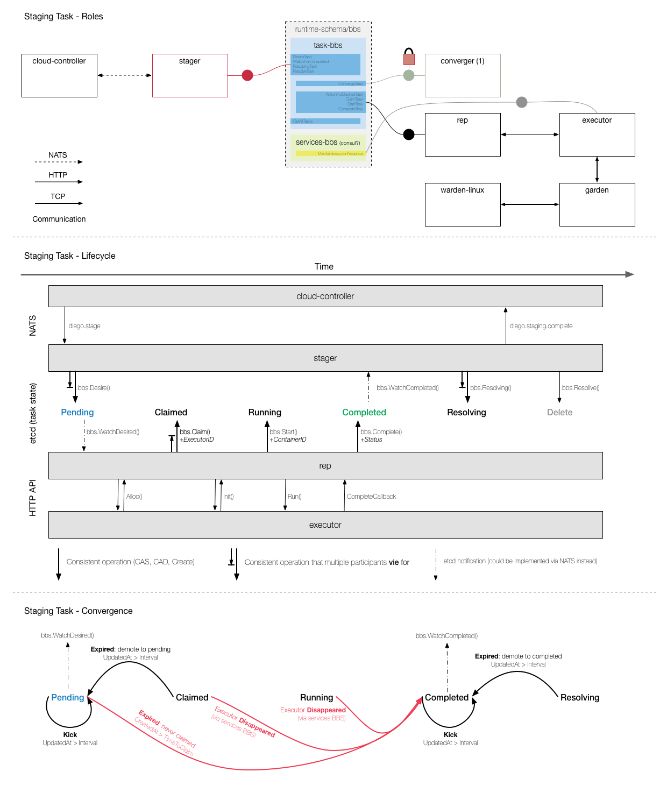

# CF Summit Talk

The Diego talk presented at CF Summit is on youtube now:
[https://www.youtube.com/watch?v=1OkmVTFhfLY](https://www.youtube.com/watch?v=1OkmVTFhfLY)

The slide-deck (in Apple .keynote format) is available [here](https://drive.google.com/file/d/0BzowTjPNRrlzWEJtSzJBWThLc0k/edit?usp=sharing)

# Diego Design Notes

These are design notes intended to convey how the various components of Diego communicate and interrelate.  It is not comprehensive and is not guaranteed to be 100% up-to-date.  If you find something that you suspect is not up-to-date please open an issue.

## What does Diego do?

Diego schedules and runs *Tasks* and *Long Running Processes*:

> A [**Task**](https://github.com/cloudfoundry-incubator/runtime-schema/blob/master/models/task.go) is guaranteed to be run *at most once*.

> A **Long Running Process** (LRP) may have multiple instances.  Diego is told of the [*desired LRPs*](https://github.com/cloudfoundry-incubator/runtime-schema/blob/master/models/desired_lrp.go).  Each desired LRP may desire multiple instances.  These instances are run (and represented as [*actual LRPs*](https://github.com/cloudfoundry-incubator/runtime-schema/blob/master/models/actual_lrp.go)).  Diego attempts to keep the correct number instances running in the face of network failures and crashes.

Both tasks and LRPs are expressed as generic, platform-independent, executable recipes.  The executable actions are defined [here](https://github.com/cloudfoundry-incubator/runtime-schema/blob/master/models/executor_action.go).  The [executor](https://github.com/cloudfoundry-incubator/executor) knows how to run these generic recipes inside [garden](https://github.com/cloudfoundry-incubator/garden) containers.

LRPs are distributed via an [auction](https://github.com/cloudfoundry-incubator/auction).  The [LRPStartAuction](https://github.com/cloudfoundry-incubator/runtime-schema/blob/master/models/lrp_start_auction.go) model contains all the details necessary to run the auction and *start* an instance of an LRP.

Diego interfaces with the existing Cloud Foundry components (notably [Cloud Controller](https://github.com/cloudfoundry/cloud_controller_ng)) and stages and runs user applications.  It does this by translating the domain-specific notion of apps into the generic language of tasks and LRPs

### A quick word about LRPs

Diego can run and maintain *multiple instances* of an LRP.  This is captured in the `Instances` property of the `DesiredLRP` model.

Diego *numbers* the instances that are running.  The numbering begins at `0` and goes up to `DesiredLRP.Instances - 1`.  Diego ensures that one (and only one) *instance* is running at a given *desired* index (i.e. an index in the range `0` to `DesiredLRP.Instances - 1`.

## What are all these repos and what do they do?

Here's a diagrammatic overview.  Ingest it slowly as you read through this section.

Here's a [PDF](https://github.com/cloudfoundry-incubator/diego-design-notes/raw/master/diego-overview.pdf) version.

Here's a [clickable image map](http://htmlpreview.github.io/?https://raw.githubusercontent.com/cloudfoundry-incubator/diego-design-notes/master/clickable-diego-overview/clickable-diego-overview.html)

This diagram includes all the major repositories/components associated with Diego.  Components on the very left live in CF-Release and are part of the current Cloud Foundry infrastructure.  Components on the right are new to Diego.

The [BBS](https://github.com/cloudfoundry-incubator/runtime-schema) lives in the middle and provides a *semantic* interface by which the various components coordinate.  The BBS is broken into different domains (e.g. `task-bbs`, `lrp-bbs`, etc...).  Each domain implements a variety of semantic methods to manage the lifecycle of the domain in question.  The various Diego components are given a view into the BBS (modelled as a Golang interface) that provides them with only the methods that concern them.

There is an interesting *specificity gradient* in this diagram.  Components near the left speak in domain-specific terms about *Apps*.  Components to the right are generic and speak in terms of generic *Tasks* and *Long Running Processes*.

#### "User-facing" Components

These "user-facing" components all live in [cf-release](https://github.com/cloudfoundry/cf-release):

- [**Cloud Controller**](https://github.com/cloudfoundry/cloud_controller_ng) (CC) 
    - provides an API for staging and running Apps.
    - implements all the object modelling around Apps (permissions, buildpack selection, service binding, etc...).
    - Developers interact with the cloud controller via the [CLI](https://github.com/cloudfoundry/cli)
- [**Loggregator**](https://github.com/cloudfoundry/loggregator)
    - aggregates and streams logs to developers
- [**Router**](https://github.com/cloudfoundry/gorouter)
    - routes incoming network traffic to processes within the CF installation
    - this includes routing traffic to both developer apps running within Garden containers and CF components such as CC.
- [**Collector**](https://github.com/cloudfoundry/collector)
    - aggregates metrics for CF-Operators.

### App Domain-Specific Diego Components

These Diego components interface with the user-facing components outlined above.  They serve, primarily, to translate app-specific notions into the generic language of LRP and Task:

- [**Stager**](https://github.com/cloudfoundry-incubator/stager)
    - receives [staging requests](https://github.com/cloudfoundry-incubator/runtime-schema/blob/master/models/staging_messages.go) from CC over NATS.
    - translates these requests into generic Tasks and submits the Tasks to the BBS.
    - instructs the executor (via the Task actions) to inject a platform-specific binary to perform the actual staging process (see [below](#platformspecific_components))
    - sends a response to CC when a Task is completed (succesfully or otherwise).
- [**Nsync**](https://github.com/cloudfoundry-incubator/nsync)
    - listens for [desired app requests](https://github.com/cloudfoundry-incubator/runtime-schema/blob/master/models/desire_app_messages.go) and updates/creates the [desired LRPs](https://github.com/cloudfoundry-incubator/runtime-schema/blob/master/models/desired_lrp.go) in the BBS.
    - periodically polls CC for all desired apps to ensure the desired state in BBS pertaining to apps is up-to-date.
- [**App-Manager**](https://github.com/cloudfoundry-incubator/app-manager)
    - watches for changes in desired LRP state pertaining to apps.
    - uses [Delta-Force](https://github.com/cloudfoundry-incubator/delta_force) to identify which actions need to take place to bring desired LRP state and actual LRP state into accord.  Three actions are possible:
        - [LRPStartAuctions](https://github.com/cloudfoundry-incubator/runtime-schema/blob/master/models/lrp_start_auction.go) are requested to start missing app instances via a distributed auction.  The LRPStartAuction model contains all information necessary to run the app (i.e. the generic executor action recipe)
        - [StopLRPInstance](https://github.com/cloudfoundry-incubator/runtime-schema/blob/master/models/lrp_start_auction.go) are requested to stop unnecessary/runaway instances.  These are targeted at specific instance guids.  No auction is held to resolve these.
        - [LRPStopAuctions](https://github.com/cloudfoundry-incubator/runtime-schema/blob/master/models/lrp_stop_auction.go) are requested whenever *multiple* app *instances* are found running at a desired *index*.  A stop auction is held to determine which app instance should be shut down.
    - instructs the executor (via the LRP actions) to inject a platform-specific binary to perform the manage running and monitoring the process (see [below](#platformspecific_components))
- [**TPS**](https://github.com/cloudfoundry-incubator/tps)
    - provides the CC with information about currently running `LRPs`.
    - this information is used by the CC to responds to `cf apps` and `cf app X` requests.
- [**File-Server**](https://github.com/cloudfoundry-incubator/file-server)
    - mediates uploads bound for the CC coming from the executor.  Translating the executor's simple HTTP POST into the complex multipart-form upload required by CC.
    - serves static assets used by our various components.  In particular, it serves the linux-circus binaries (see below).
    - someday the File-Server (and the parts of CC that are concerned with uploading and downloading blobs) will be replaced with a proper blob-store-abstraction service.

### Diego Components that Handle Tasks/LRPs

These Diego components deal with running and maintaining generic Tasks and LRPs:

- [**Rep**](https://github.com/cloudfoundry-incubator/rep)
    - represents an *executor* and mediates all communication with the consistent store.
    - responsible for monitoring for and running tasks and LRPs:
        - watches for desired Tasks, claims them if resources are available, runs them via the Executor, then returns success/failure.
        - participates in `LRPStartAuctions` and, upon winning an auction, starts the LRP on the executor.
        - registers actual running LRPs in the consistent store.
        - stops LRPs (either by handling relevant `StopLRPInstance` requests or by participating in an `LRPStopAuction`)
        - participation in auctions is mediated by the [auction](https://github.com/cloudfoundry-incubator/auction) package.  Auction communication goes over NATS via the `auction_nats_server`.
- [**Executor**](https://github.com/cloudfoundry-incubator/executor)
    - provides an HTTP API to:
        - ALLOC containers (reserves resources for a container)
        - INIT containers (spins up a Garden container with appropriate disk/memory limits in place)
        - RUN generic recipes in a previously allocated container
        - DELETE a container (also stops all running code in the container)
    - the executor is primarily responsible for implementing the generic [executor actions](https://github.com/cloudfoundry-incubator/runtime-schema/blob/master/models/executor_action.go):
        - `DownloadAction` downloads a blob from a URL and places it in a destination in the container.  Uses the [cached-downloader](https://github.com/pivotal-golang/cacheddownloader) to perform caching.  Uses the [archiver](https://github.com/pivotal-golang/archiver) to decompress/untar if requested.
        - `UploadAction` uploads a blob from the container to a URL.  Uses the [archiver](https://github.com/pivotal-golang/archiver) to tar/compress if requested.
        - `RunAction` runs a script in the context of given environment variables with an alloted (optional) timeout.
        - `FetchResultAction` reads a file from the container and returns its contents.
        - `MonitorAction` performs a given `ExecutorAction` (typically a `RunAction`) and runs it periodically.  Success implies a healthy container.  Failure implies an unhealthy container.  Communicates healthy/unhealthy via an http callback.
    - when running a `RunAction` the executor can stream stdout and stderr to Loggregator
- [**Garden**](https://github.com/cloudfoundry-incubator/garden)
    - provides a platform-independent server/client to manage garden containers
    - defines an interface to be implemented by container-runners (e.g. [warden-linux](https://github.com/cloudfoundry-incubator/warden-linux))
- [**Auctioneer**](https://github.com/cloudfoundry-incubator/auctioneer)
    - runs auctions for requested `LRPStartAuctions` and `LRPStopAuctions`
    - auctions are run using the [auction](https://github.com/cloudfoundry-incubator/auction) package.  Auction communication goes over NATS via the `auction_nats_client`.
    - maintains a lock in the consistent store such that *only **one*** auctioneer handles auctions. This enables the pool of auctioneers to limit the number of concurrent auctions to ensure a correct (and performant) distribution of LRPs.
    - contains the business logic for determining which Reps may participate in the auction (currently limited to stack-specificity)
- [**Converger**](https://github.com/cloudfoundry-incubator/converger)
    - maintains a lock in the consistent store to ensure that *only **one*** converger performs convergence.  This is primarily for performance considerations.  Convergence should be idempotent.
    - uses the converge methods in the runtime-schema/bbs to ensure eventual consistency and fault tolerance for:
        - tasks
        - lrps (desired vs acutal)
        - start auctions
        - stop auctions
- [**Route-Emitter**](https://github.com/cloudfoundry-incubator/route-emitter)
    - monitors desired LRP state and actual LRP state.  When a change is detected, the Route-Emitter emits route registration/unregistration messages to the [router](https://github.com/cloudfoundry/gorouter)
    - periodically emits the entire routing table to the router.
    - someday the route-emitter will be a part of the router, which will read from the consistent store to compute the routing table.

### Platform-Specific Components

Diego is largely platform agnostic.  All platform specific concerns are delegated to two components:

- [**Warden-Linux**](https://github.com/cloudfoundry-incubator/warden-linux)
    - provides a linux-specific implementation of a Garden interface:
        - can create/delete containers
        - can apply resource limits to containers
        - can open and attach network ports to containers
        - can copy files into/out of containers
        - can run processes within containers, streaming back stdout and stderr data
        - can annotate containers with arbitrary metadata
        - can snapshot containers for down-timeless redeploys
- [**Linux-Circus**](https://github.com/cloudfoundry-incubator/linux-circus)
    - provides binaries that are side-loaded into containers to manage *App*-specific lifecycle issues.  There are three binaries:
        - **tailor** is reponsible for *staging*.  The stager instructs the executor to [configure](https://github.com/cloudfoundry-incubator/runtime-schema/blob/master/models/circus_tailor_config.go), inject and run the tailor in the Garden container.  The tailor knows how to run buildpacks against the user's app bits and construct the resulting droplet.
        - **soldier** is responsible for *launching* apps.  It ensures the app is launched with the correct environment variables.  The app-manager instructs the executor to inject and run the soldier.
        - **spy** is responsible for verifying the health of the app.  It is periodically launched within the Garden container by the executor.

### Bringing it all together

Diego is made of very many disparate components.  Ensuring that these components work together correctly is a challenge addressed by these entities:

- [**Runtime-Schema**](https://github.com/cloudfoundry-incubator/runtime-schema)
    - encodes all communication between all the Diego components.
    - access to the consistent store is mediated via the BBS.  The BBS is comprised of several domain-specific sub-BBS packages.  Each Diego component is then given a *view* into the BBS (implemented as a Golang interface) to clarify the role and responsibility of the component.
    - the models by which components communicate are encoded in the models package.
- [**Inigo**](https://github.com/cloudfoundry-incubator/inigo)
    - is an integration test suite that launches the various Diego components and excercises them through various test cases.  As such, Inigo *validates* that a given set of component versions are mutually compatible.
    - in addition to excercising various *non-exceptional* test cases, Inigo can excercise exceptional cases (e.g. when a component fails).
- [**Auction**](https://github.com/cloudfoundry-incubator/auction)
    - encodes the distributed start and stop auctions.
    - includes a simulation test suite that validates the correctness and performance of the auction algorithm.  The simulation can be run for different algorithms, at different scales.  The simulation can either be run in-process (for quick feedback loops) or across multiple processes (to understand the role of communication in the auction) or even across multiple machines in a cloud-like infrastructure (to understand the impact of latency on the auction).
    - includes a NATS server and client for handling auction-related communication.
    - the auctioneer and rep use the auction package to participate in the auction.
- [**CF-Acceptance-Tests**](https://github.com/cloudfoundry/cf-acceptance-tests)
    - are a suite of acceptance-level tests that run against a deployed Diego release.
    - these excercise a number of happy-path test cases across the entire stack.
    - use the cf cli to run the tests.

### The release

Diego is packaged up as a bosh release called [**diego-release**](https://github.com/cloudfoundry-incubator/diego-release).  The [README](https://github.com/cloudfoundry-incubator/diego-release) includes detailed instructions for getting a bosh-lite deployment up and running.

### Other Components

- [**ETCD**](https://github.com/coreos/etcd)
    - is the consistent store at the heart of diego
    - all components that access etcd do so via the runtime-schema/bbs.
- [**NATS**](https://github.com/apcera/gnatsd)
    - is the message bus used to communicate between various components
    - in particular, NATS is used to perform the (quite chatty) auction.
- [**Metrics-Server**](https://github.com/cloudfoundry-incubator/runtime-metrics-server)
    - reads metrics from the BBS and publishes them to the collector
- [**Storeadapter**](https://github.com/cloudfoundry/store-adapter)
    - provides a driver for interfacing with etcd.

## What is the life-cycle of a Diego Task?

Here's a [PDF](https://github.com/cloudfoundry-incubator/diego-design-notes/raw/master/task-lifecycle.pdf) version.

The top panel illustrates the components that participate when staging an app.

The middle panel shows the flow of information during the staging process across the various components.  Time moves forward along the x-axis as information flows from the more specific app-domain of the cloud-controller and stager on the top down to the more generic task-domain of the rep and exeuctor on the bottom.  The middle row in this diagram illustrates the state the Task is in as it flows through its lifecycle.

The bottom panel illustrates the role that convergence plays in the task lifecycle.  The converger periodically loads all the tasks into memory then iterates through each one.  The converge makes decisions, based on the task's state, to (possibly) move the task into another state.  The basic idea, here, is that messages can be missed (so, for example, Pending tasks may need to be readvertized periodically) and components may disappear at arbitrary times in the Task's lifecycle (so, for example, the executor running a task may disappear at random; this causes the Running task to be marked as Completed and failed).

## What is the life-cycle of a Diego Long-Running-Process?

WIP
