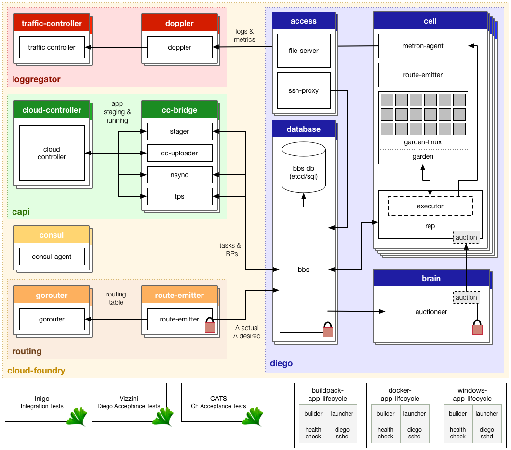

# Diego Design Notes

These are design notes intended to convey how the various components of Diego communicate and interrelate.  It is not comprehensive and is not guaranteed to be up-to-date.  If you find something that you suspect is not up-to-date please open an issue.

## Migrating to Diego

Diego is getting close to production readiness!  We've put together some [guidelines](migrating-to-diego.md) around transitioning applications off of the DEAs and onto Diego. One reason to move your apps to Diego is to [try out SSH access to your CF app instances and Diego LRPs](ssh-access-and-policy.md).

## What does Diego do?

Diego schedules and runs *Tasks* and *Long Running Processes*:

> A [**Task**](https://github.com/cloudfoundry-incubator/runtime-schema/blob/master/models/task.go) is guaranteed to be run *at most once*.

> A **Long Running Process** (LRP) may have multiple instances.  Diego is told of the *desired LRPs*.  Each desired LRP may desire multiple instances.  These instances are run and represented as *actual LRPs*.  Diego attempts to keep the correct number of instances running in the face of network failures and crashes.

Tasks and LRPs are submitted to Diego via a RESTful HTTP API documented extensively in Diego's [Receptor API docs](https://github.com/cloudfoundry-incubator/receptor/blob/master/doc/README.md).  Diego's [Auctioneer](https://github.com/cloudfoundry-incubator/auctioneer) optimally distributes Tasks and LRPs to the cluster of Diego Cells via an [Auction](https://github.com/cloudfoundry-incubator/auction) involving the Cell [Rep](https://github.com/cloudfoundry-incubator/rep)s.  Once a Task/LRP is assigned to a Cell, the [Executor](https://github.com/cloudfoundry-incubator/executor) spins up a [Garden](https://github.com/cloudfoundry-incubator/garden) container and executes the work encoded in the Task/LRP.  This work is encoded as a generic, platform-independent, recipe of composable [actions](https://github.com/cloudfoundry-incubator/receptor/blob/master/doc/actions.md).

An up-to-date cache of the state of the Diego cluster (including a picture-in-time of all desired LRPs, running LRP instances, and inflight Tasks) is maintained in the [BBS](https://github.com/cloudfoundry-incubator/runtime-schema) (Bulletin Board System/Store).  The [Converger](https://github.com/cloudfoundry-incubator/converger) operates on the BBS periodically and takes actions to ensure Diego attains eventual consistency.

Diego interfaces with [doppler](https://github.com/cloudfoundry/loggregator) to provide real-time streaming logs for all Tasks/LRPs.  Diego also interfaces with the [gorouter](https://github.com/cloudfoundry/gorouter) to automatically route web traffic to running LRP instances.

Diego is the next-generation runtime powering Cloud Foundry (CF), however Diego is abstracted away from CF: CF simply consumes Diego via the Receptor API.  For now, there is a translation layer called the CC-Bridge that converts the [Cloud Controller](https://github.com/cloudfoundry/cloud_controller_ng)'s domain-specific requests to stage and run applications into requests for Tasks and LRPs.  Eventually Cloud Controller will be modified to communicate directly with the Receptor.  The process of staging and running a CF application is complex and filled with platform and implementation-specific details.  We encapsulate these concerns in a triad of binaries known collectively as the [App Lifecycle](#app-lifecycles).  The Tasks and LRPs produced by the CC-Bridge download the App Lifecycle binaries and run them to stage, start, and health-check CF applications.

## CF Summit Talk

The Diego talk presented at CF Summit is on youtube:
[https://www.youtube.com/watch?v=1OkmVTFhfLY](https://www.youtube.com/watch?v=1OkmVTFhfLY)

The slide-deck (in Apple .keynote format) is available [here](https://drive.google.com/file/d/0B55cOnKV7PrQaTBKRjg4MjE1Ujg/view?usp=sharing)

The presentation slide for Diego Talk is available [here](http://www.slideshare.net/Pivotal/cloud-foundry-summit-2014-diego-reenvisioning-the-elastic-runtime)

## What are all these repos and what do they do?

Here's a diagrammatic overview.  Ingest it slowly as you read through this section.

Here's a [PDF](https://github.com/cloudfoundry-incubator/diego-design-notes/raw/master/diego-overview.pdf) version.

Here's a [clickable image map](http://htmlpreview.github.io/?https://raw.githubusercontent.com/cloudfoundry-incubator/diego-design-notes/master/clickable-diego-overview/clickable-diego-overview.html)

This diagram includes all the major repositories/components associated with Diego.

Components in the blue region are part of the Diego core and handle the running and monitoring of Tasks and LRPs.  These components all live in the [Diego-Release](https://github.com/cloudfoundry-incubator/diego-release) BOSH release.

Components in the yellow region bring support for streaming logs and routing to Diego containers.  Some of these components live in [Diego-Release](https://github.com/cloudfoundry-incubator/diego-release) while others live in [CF-Release](https://github.com/cloudfoundry/cf-release).  The [Lattice](https://github.com/pivotal-cf-experimental/lattice) distribution includes these components and offers developers an easy-to-install environment for interacting with Diego.

The red region brings in [Cloud Controller](https://github.com/cloudfoundry/cloud_controller_ng) and the CC-Bridge.  As the diagram shows, the CC-Bridge merely interfaces with the Receptor translating app-specific messages from the CC to the more generic language of Tasks and LRPs.

The following summarizes the roles and responsibilities of the various components in this diagram.

#### "User-facing" Components

These "user-facing" components all live in [cf-release](https://github.com/cloudfoundry/cf-release):

- [**Cloud Controller**](https://github.com/cloudfoundry/cloud_controller_ng) (CC)
    - provides an API for staging and running Apps.
    - implements all the object modelling around Apps (permissions, buildpack selection, service binding, etc...).
    - Developers interact with the cloud controller via the [CLI](https://github.com/cloudfoundry/cli)
- [**Doppler**](https://github.com/cloudfoundry/loggregator)
    - aggregates and streams logs to developers
- [**Router**](https://github.com/cloudfoundry/gorouter)
    - routes incoming network traffic to processes within the CF installation
    - this includes routing traffic to both developer apps running within Garden containers and CF components such as CC.

### CC-Bridge Components

The CC-Bridge components interface with the Cloud Controller.  They serve, primarily, to translate app-specific notions into the generic language of LRP and Task:

- [**Stager**](https://github.com/cloudfoundry-incubator/stager)
    - receives staging requests from CC
    - translates these requests into generic Tasks and submits the Tasks to the Receptor
        - instructs the Cell (via the Task actions) to inject a platform-specific binary to perform the actual staging process (see [below](#platform-specific-components))
        - sends a response to CC when a Task is completed (succesfully or otherwise).
- [**Nsync**](https://github.com/cloudfoundry-incubator/nsync)
    - listens for desired app requests and updates/creates the desired LRPs via the Receptor.
    - periodically polls CC for all desired apps to ensure the desired state known to Diego is up-to-date.
- [**TPS**](https://github.com/cloudfoundry-incubator/tps)
    - provides the CC with information about currently running `LRPs`.
    - this information is used by the CC to responds to `cf apps` and `cf app X` requests.
- [**File-Server**](https://github.com/cloudfoundry-incubator/file-server)
    - mediates uploads bound for the CC coming from the Executor.  Translating the Executor's simple HTTP POST into the complex multipart-form upload required by CC.
    - serves static assets used by our various components.  In particular, it serves the App Lifecycle binaries (see [below](#app-lifecycles)).

### Components on the Cell

These Diego components deal with running and maintaining generic Tasks and LRPs:

- [**Receptor**](https://github.com/cloudfoundry-incubator/receptor) implements a RESTful [HTTP API](https://github.com/cloudfoundry-incubator/receptor/blob/master/doc/README.md) that allows consumers of Diego to:
    + request Task and DesiredLRPs
    + fetch information about currently running Tasks and LRP instances
- [**Rep**](https://github.com/cloudfoundry-incubator/rep)
    - represents a Cell and mediates all communication with the BBS by:
        + ensuring the set of Tasks and ActualLRPs in the BBS is in sync with the containers actually present on the Cell
        + maintaining the presence of the Cell in the BBS.  Should the Cell fail catastrophically, the Converger will automatically move the missing instances to other Cells.
    - participates in [auctions](https://github.com/cloudfoundry-incubator/auction) to accept Tasks/LRPs
    - runs Tasks/LRPs by asking its in-process Executor to create a container and run generic action recipes in said container.
- [**Executor**](https://github.com/cloudfoundry-incubator/executor)
    - the Executor doesn't know about the Task vs LRP distinction.  It is primarily responsible for implementing the generic executor actions detailed in the [API documentation](https://github.com/cloudfoundry-incubator/receptor/blob/master/doc/actions.md)
    - the Executor streams Stdout and Stderr to the metron-agent running on the Cell.  These then get forwarded to Loggregator.
- [**Garden**](https://github.com/cloudfoundry-incubator/garden)
    - provides a platform-independent server/client to manage garden containers
    - defines an interface to be implemented by container-runners (e.g. [garden-linux](https://github.com/cloudfoundry-incubator/garden-linux))
- [**Metron**](https://github.com/cloudfoundry/loggregator/tree/develop/src/metron)
    - Forwards application logs and application/Diego metrics to [doppler](https://github.com/cloudfoundry/loggregator)

Note that there is a specificity gradient across the Rep/Executor/Garden.  The Rep is concerned with Tasks and LRPs and knows details about their lifecycles.  The Executor knows nothing about Tasks/LRPs but merely knows how to manage a collection of containers and run actions in these containers.  Garden, in turn, knows nothing about actions and simply provides a concrete implementation of a platform-specific containerization technology that can run arbitrary commands in containers.

Only the Rep and the Receptor communicate with the BBS and participate in inter-Cell communication.

### Components on the Brain

- [**Auctioneer**](https://github.com/cloudfoundry-incubator/auctioneer)
    - holds auctions for Tasks and ActualLRP instances.
    - auctions are run using the [auction](https://github.com/cloudfoundry-incubator/auction) package.  Auction communication goes over HTTP and is between the Auctioneer and the Cell Reps.
    - maintains a lock in the BBS such that ***only one*** auctioneer may handles auctions at a time.
- [**Converger**](https://github.com/cloudfoundry-incubator/converger)
    - maintains a lock in the BBS to ensure that ***only one*** converger performs convergence.  This is primarily for performance considerations.  Convergence should be idempotent.
    - uses the converge methods in the runtime-schema/bbs to ensure eventual consistency and fault tolerance for Tasks and LRPs
    - when converging LRPs, the converger uses identifies which actions need to take place to bring DesiredLRP state and ActualLRP state into accord.  Two actions are possible:
        - if an instance is missing, a start auction is sent.
        - if an extra instance is identified, a stop message is sent to the Rep on the Cell hosting the instance.
    - in addition, the converger watches out for any potentially missed messages.  For example, if a Task has been in the PENDING state for too long it's possible that the request to hold an auction for the Task never made it to the Auctioneer.  In this case the Converger is responsible for resending the auction message.
- [**Metrics-Server**](https://github.com/cloudfoundry-incubator/runtime-metrics-server)
    - reads metrics from the BBS and publishes them to Doppler.

### Additional (shim-like) components

- [**Route-Emitter**](https://github.com/cloudfoundry-incubator/route-emitter)
    - monitors DesiredLRP state and ActualLRP state via the Receptor.  When a change is detected, the Route-Emitter emits route registration/unregistration messages to the [router](https://github.com/cloudfoundry/gorouter)
    - periodically emits the entire routing table to the router.
    - someday the route-emitter will be a part of the router, which will communicate with the Receptor to compute the routing table.

### Platform-Specific Components

Diego is largely platform-agnostic.  All platform-specific concerns are delegated to two types of components: the *garden backends* and the *app lifecycles*.

#### Garden Backends

[**Garden**](https://github.com/cloudfoundry-incubator/garden) contains a set of interfaces each platform-specific backend must implement. These interfaces contain methods to perform the following actions:

- create/delete containers
- apply resource limits to containers
- open and attach network ports to containers
- copy files into/out of containers
- run processes within containers, streaming back stdout and stderr data
- annotate containers with arbitrary metadata
- snapshot containers for down-timeless redeploys

Current implementations:

- [**Garden-Linux**](https://github.com/cloudfoundry-incubator/garden-linux) provides a linux-specific implementation of a Garden interface.

#### App Lifecycles

Each App Lifecycle provides a set of binaries that manage a *Cloud Foundry*-specific application lifecycle.  There are three binaries:

- The **Builder** *stages* a CF application.  The CC-Bridge runs the Builder as a Task on every staging request.  The Builder perfoms static analysis on the application code and does any necessary pre-processing before the application is first run.
- The **Launcher** *runs* a CF application.  The CC-Bridge sets the Launcher as the Action on the CF application's DesiredLRP.  The Launcher executes the user's start command with the correct system context (working directory, environment variables, etc).  
- The **Healthcheck** performs a status check of running CF application from inside the container.  The CC-Bridge sets the Healthcheck as the Monitor action on the CF application's DesiredLRP. 

Current implementations:

- [**Buildpack-App-Lifecycle**](https://github.com/cloudfoundry-incubator/buildpack-app-lifecycle) implements a traditional buildpack-based lifecycle.
- [**Docker-App-Lifecycle**](https://github.com/cloudfoundry-incubator/docker-app-lifecycle) implements a docker-based lifecycle.

### Bringing it all together

Diego is made of very many disparate components.  Ensuring that these components work together correctly is a challenge addressed by these entities:

- [**Runtime-Schema**](https://github.com/cloudfoundry-incubator/runtime-schema)
    - encodes all communication between Diego components and the BBS.  The Receptor, Rep, and Converger are the primary consumers of Runtime-Schema.
    - access to the consistent store is mediated via the BBS.  The BBS is comprised of several domain-specific sub-BBS packages.  Each Diego component is then given a *view* into the BBS (implemented as a Golang interface) to clarify the role and responsibility of the component.
    - the models by which components communicate are encoded in the models package.
- [**Inigo**](https://github.com/cloudfoundry-incubator/inigo)
    - is an integration test suite that launches the various Diego components and excercises them through various test cases.  As such, Inigo *validates* that a given set of component versions are mutually compatible.
    - in addition to excercising various *non-exceptional* test cases, Inigo can excercise exceptional cases (e.g. when a component fails).
- [**Auction**](https://github.com/cloudfoundry-incubator/auction)
    - encodes the behavioral details around the auction.
    - includes a simulation test suite that validates the correctness and performance of the auction algorithm.  The simulation can be run for different algorithms, at different scales.  The simulation can either be run in-process (for quick feedback loops) or across multiple processes (to understand the role of communication in the auction) or even across multiple machines in a cloud-like infrastructure (to understand the impact of latency on the auction).
    - the auctioneer and rep use the auction package to participate in the auction.
- [**Diego-Acceptance-Tests**](https://github.com/cloudfoundry-incubator/diego-acceptance-tests)
    - are a suite of acceptance-level tests that run against a deployment of CF release and Diego release.
    - these exercise a number of happy-path test cases across the entire stack.
    - use the cf cli to run the tests.

### The Release

Diego is packaged up as a bosh release called [**Diego-Release**](https://github.com/cloudfoundry-incubator/diego-release).  The [README](https://github.com/cloudfoundry-incubator/diego-release) includes detailed instructions for getting a bosh-lite deployment up and running.

Diego-Release is also the **canonical** `GOPATH` for the Diego.  All development takes place in Diego-Release

### Other Components

- [**ETCD**](https://github.com/coreos/etcd)
    - is the consistent store at the heart of diego
    - all components that access etcd do so via the runtime-schema/bbs.
- [**Storeadapter**](https://github.com/cloudfoundry/storeadapter)
    - provides a driver for interfacing with etcd.
